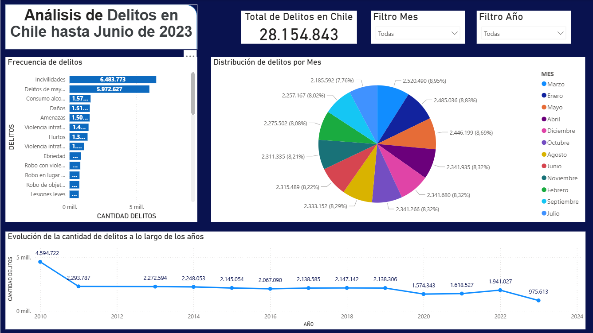
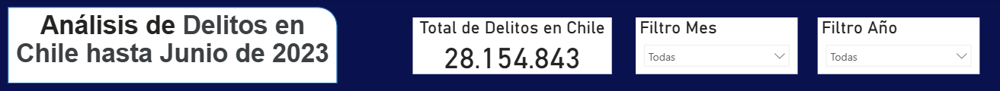
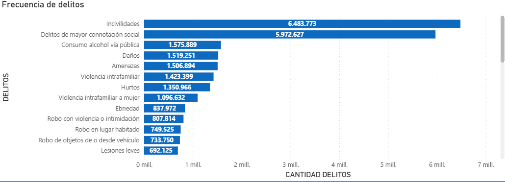
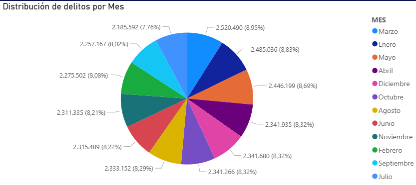

# 🖥️ Dashboard de Delitos en Chile – Estadísticas Oficiales 2023

Este proyecto presenta un **dashboard interactivo desarrollado en Power BI**, basado en el archivo `estadisticas-delictuales_Chile.xlsx`.  
El objetivo es analizar el comportamiento de distintos tipos de delitos en Chile, identificar tendencias temporales, y facilitar la toma de decisiones para políticas de seguridad pública.

---

## 🎯 Objetivos del proyecto
- Visualizar métricas clave de delitos, violencia intrafamiliar (VIF) e incivilidades.  
- Analizar el comportamiento de los delitos por tipo, mes, año y región.  
- Detectar tendencias y patrones estacionales en criminalidad.  
- Facilitar la interpretación de datos para autoridades y entidades de seguridad pública.  

---

## 📊 Vistas principales del dashboard

### 📌 Portada.

> Estos KPIs permiten ver de un vistazo la magnitud de los distintos tipos de delitos reportados.

### ⚙️ Importancia de los filtros y segmentadores
**Filtros y segmentadores** permiten al usuario explorar los datos de manera interactiva y enfocarse en información específica:  
- **Por año (`AÑO`)**: analizar tendencias anuales y comparar períodos históricos.  
- **Por mes (`MES`)**: identificar picos estacionales o cambios mensuales en la criminalidad.  

**Beneficios**:  
- Facilitan la interpretación de grandes volúmenes de datos.  
- Permiten identificar patrones y comportamientos relevantes en distintos contextos.  
- Hacen que el dashboard sea dinámico y adaptable a distintos análisis o audiencias.  

> Los segmentadores y filtros son esenciales para que los tomadores de decisiones puedan explorar la información de forma rápida, intuitiva y efectiva.  

### 🔢 Frecuencia de delitos por tipo
**Gráfico de barras**  
- Muestra la **cantidad de veces que ocurrió cada delito** durante el período seleccionado.  
- Permite identificar los delitos más frecuentes y los que requieren mayor atención.

### 🥧 Cantidad de delitos por mes a lo largo de los años.
**Gráfico de torta**  
- Cada porción representa la **proporción de cada tipo de delito respecto al total en un mes a lo largo de los años**.  
- Útil para ver qué delitos predominan en un mes determinado.
- Al aplicar los filtros se puede comparar meses entre años y asi encontrar algun patron de comportamiento en los delitos.

### 📈 Evolución de la cantidad de delitos a lo largo de los años.
**Gráfico de líneas**  
- Muestra la **cantidad total de delitos en cada año de la base de datos**.  
- Permite detectar tendencias, picos estacionales y descensos de criminalidad a lo largo del tiempo.

---

## 📂 Archivos del repositorio
- `/pbix/dashboard_delitos_chile.pbix` – Archivo principal de Power BI.  
- `/data/datos_delitos_chile.xlsx` – Dataset utilizado.  
- `/imagenes/` – Capturas del dashboard.  
- `/docs/medidas_dax.md` – Documentación de fórmulas DAX.  
- `/docs/diccionario_datos.md` – Descripción de columnas del dataset.  

---

## 🚀 Cómo usarlo
1. Descarga el archivo `.pbix` desde la carpeta `/pbix/`.  
2. Ábrelo en Power BI Desktop.  
3. Explora las distintas páginas y filtros interactivos (AÑO, MES, tipo de delito).  

---

## 🧠 Hallazgos clave
- Los delitos con la mayor frecuencia, no corresponde a delitos graves, sino a Incivilidades y Delitos de mayor conotación social, los cuales superan los 5 millones.
- La mayor cantidad de delitos se generan los meses de marzo, enero y mayo respectivamente, superando el 8.5%, teniendo todos como peack el año 2010.
- Entre 2010 y 2022, la cantidad de delitos se redujo en 2.680.695 delitos, lo que equivale a un 58,3 % menos.
- La distribución mensual permite detectar meses con mayor riesgo y planificar estrategias preventivas. 

---

## 📌 Tecnologías utilizadas
- Power BI Desktop  
- Power Query  
- DAX  
