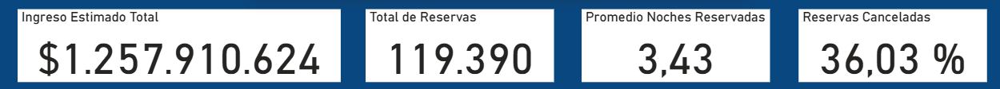

# 🖥️ Dashboard de Reservas de Hotel – Hotel Bookings

Este proyecto presenta un **dashboard interactivo desarrollado en Power BI**, basado en el archivo `hotel_bookings.csv`.  
El objetivo es analizar el comportamiento de las **reservas hoteleras**, identificando patrones de estacionalidad, cancelaciones, duración de estadías y variaciones de tarifa (ADR), para **facilitar la toma de decisiones** en gestión y estrategia comercial.

Recomiendo leer primero el documento del proyecto 2 [README de Data Power Bi](Data%20Power%20Bi/README.md)

---

## 🎯 Objetivos del proyecto
- Visualizar métricas clave: **reservas totales, % de cancelaciones, noches promedio e ingreso estimado** (ADR × noches).  
- Analizar el comportamiento por **tipo de hotel** (City vs Resort), **mes y año**, **mercado/segmento** y **nacionalidad**.  
- Detectar **tendencias temporales** (picos y bajas estacionales) y variaciones de **ADR**.  
- Entregar una vista ejecutiva que apoye **decisiones operativas y comerciales** (capacidad, pricing, marketing).

---

## 📊 Vistas principales del dashboard – Hotel Bookings

### 📌 Portada y KPIs
Tarjetas con indicadores clave:
- **Total de reservas**
- **% de cancelaciones**
- **Promedio de noches por reserva**
- **Ingreso estimado total** (ADR × noches)
- **Nacionalidad más frecuente**

> Estos KPIs permiten dimensionar el volumen, el riesgo (cancelaciones), la duración típica de estadías y el potencial de ingresos.

### ⚙️ Importancia de los filtros y segmentadores
Los **filtros** permiten explorar los datos de forma interactiva y responder preguntas específicas:
- **Año / Mes de check-in**: estacionalidad, picos de demanda y cambios de precio.
- **Tipo de hotel** (City vs Resort): diferencias operativas y comerciales.
- **Estado de reserva** (efectiva/cancelada): impacto en ocupación e ingresos esperados.
- **Segmento / Canal** (si aplica): comportamiento por mercado.

**Beneficios**: facilitan interpretar grandes volúmenes, encontrar patrones en distintos contextos y adaptar el dashboard a distintas audiencias y decisiones.

### 🔢 Reservas por tipo (categorías comparables)
**Gráfico de barras**  
Muestra la **cantidad de reservas** por categoría relevante (p. ej., *hotel, mercado, canal o país*).  
Sirve para detectar concentraciones y oportunidades de diversificación.

### 🥧 Distribución mensual de reservas
**Gráfico de torta/donut**  
Cada porción representa la **proporción de reservas del mes** respecto del total.  
Con filtros de año/hotel puedes **comparar meses entre años** y descubrir estacionalidad marcada.

### 📈 Evolución temporal
**Gráfico de líneas**  
Muestra la **tendencia de reservas por mes/año** (y, opcionalmente, **ADR** en una segunda línea o página).  
Ayuda a detectar temporadas altas/bajas, recuperaciones o caídas.

---

## 📂 Archivos del repositorio
- `/pbix/dashboard_hotel_bookings.pbix` – Archivo principal de Power BI.  
- `/data/hotel_bookings.csv` – Dataset utilizado.  
- `/images/` – Capturas del dashboard.  
- `/docs/medidas_dax.md` – Medidas DAX utilizadas.  
- `/docs/diccionario_datos.md` – Descripción de columnas.

---

## 🚀 Cómo usarlo
1. Descarga el archivo `.pbix` desde `/pbix/`.  
2. Ábrelo en **Power BI Desktop**.  
3. Explora las páginas y **filtros interactivos** (Año, Mes, Tipo de hotel, Estado de reserva, Segmento).

---

## 🧠 Hallazgos clave (ejemplos a validar con tu data)
- La **estacionalidad** concentra reservas en meses específicos; el **ADR** tiende a subir en temporada alta.  
- **City Hotel** vs **Resort Hotel** muestran patrones distintos de **cancelación** y **duración de estadía**.  
- Ciertos **mercados/nacionalidades** presentan mayor propensión a cancelación o estadías más largas.

---

## 📌 Tecnologías utilizadas
- **Power BI Desktop**  
- **Power Query**  
- **DAX**  
- **Excel** (apoyo)
