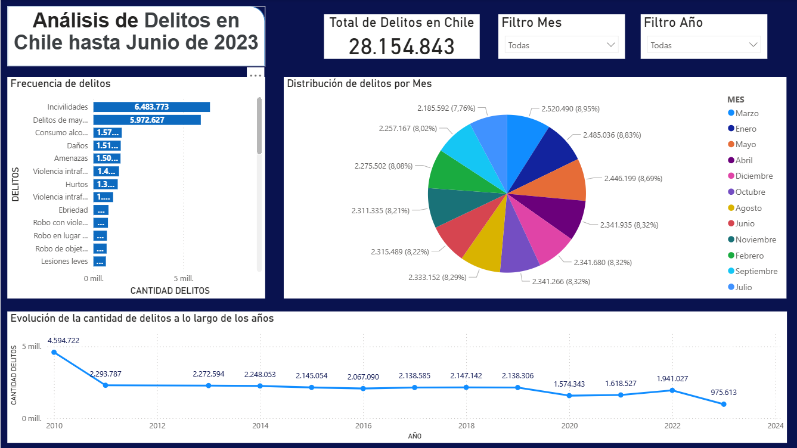

# 🖥️ Dashboard de Delitos en Chile – Estadísticas Oficiales 2023

Este proyecto presenta un **dashboard interactivo desarrollado en Power BI**, basado en el archivo `datos_delitos_chile.xlsx`.  
El objetivo es analizar el comportamiento de distintos tipos de delitos en Chile, identificar tendencias temporales y geográficas, y facilitar la toma de decisiones para políticas de seguridad pública.

---

## 🎯 Objetivos del proyecto
- Visualizar métricas clave de delitos, violencia intrafamiliar (VIF) e incivilidades.  
- Analizar el comportamiento de los delitos por tipo, mes, año y región.  
- Detectar tendencias y patrones estacionales en criminalidad.  
- Facilitar la interpretación de datos para autoridades y entidades de seguridad pública.  

---

## 📊 Vistas principales del dashboard

### 📌 Portada.

> Estos KPIs permiten ver de un vistazo la magnitud de los distintos tipos de delitos reportados.

### 🔢 Frecuencia de delitos por tipo
**Gráfico de barras**  
- Muestra la **cantidad de veces que ocurrió cada delito** durante el período seleccionado.  
- Permite identificar los delitos más frecuentes y los que requieren mayor atención.

  

### 🥧 Distribución de delitos por tipo – Mes seleccionado
**Gráfico de torta/donut**  
- Cada porción representa la **proporción de cada tipo de delito respecto al total en un mes**.  
- Útil para ver qué delitos predominan en un mes determinado y comparar meses entre años.  

### 📈 Evolución de delitos a lo largo del año
**Gráfico de líneas**  
- Muestra la **cantidad total de delitos o de un delito específico mes a mes dentro de un año**.  
- Permite detectar tendencias, picos estacionales y descensos de criminalidad a lo largo del tiempo.  

### 🌍 Mapa Regional de delitos
**Mapa de calor**  
- Visualización geográfica de la **incidencia de delitos por región**.  
- Permite identificar “puntos calientes” y regiones con mayor criminalidad.  

### ⚙️ Importancia de los filtros y segmentadores
**Filtros y segmentadores** permiten al usuario explorar los datos de manera interactiva y enfocarse en información específica:  

- **Por año (`AÑO`)**: analizar tendencias anuales y comparar períodos históricos.  
- **Por mes (`MES`)**: identificar picos estacionales o cambios mensuales en la criminalidad.  
- **Por tipo de delito**: enfocar el análisis en delitos específicos, como homicidios, hurtos o violencia intrafamiliar.  
- **Por región (si se agrega)**: estudiar la distribución geográfica de los delitos y detectar puntos calientes.  

**Beneficios**:  
- Facilitan la interpretación de grandes volúmenes de datos.  
- Permiten identificar patrones y comportamientos relevantes en distintos contextos.  
- Hacen que el dashboard sea dinámico y adaptable a distintos análisis o audiencias.  

> Los segmentadores y filtros son esenciales para que los tomadores de decisiones puedan explorar la información de forma rápida, intuitiva y efectiva.  

---

---

## 📂 Archivos del repositorio
- `/pbix/dashboard_delitos_chile.pbix` – Archivo principal de Power BI.  
- `/data/datos_delitos_chile.xlsx` – Dataset utilizado.  
- `/images/` – Capturas del dashboard.  
- `/docs/medidas_dax.md` – Documentación de fórmulas DAX.  
- `/docs/diccionario_datos.md` – Descripción de columnas del dataset.  

---

## 🚀 Cómo usarlo
1. Descarga el archivo `.pbix` desde la carpeta `/pbix/`.  
2. Ábrelo en Power BI Desktop.  
3. Explora las distintas páginas y filtros interactivos (AÑO, MES, tipo de delito, región).  

---

## 🧠 Hallazgos clave (ejemplo)
- Algunos delitos comunes no siempre corresponden a delitos graves; los más críticos requieren análisis focalizado.  
- La violencia intrafamiliar presenta patrones estacionales y diferencias entre género y edad.  
- Las regiones urbanas concentran la mayoría de delitos reportados, mientras que ciertas zonas rurales presentan incidencias específicas (como abigeato o robos en lugares no habitados).  
- La distribución mensual permite detectar meses con mayor riesgo y planificar estrategias preventivas.  

---

## 📌 Tecnologías utilizadas
- Power BI Desktop  
- Power Query  
- DAX  
- Excel  
